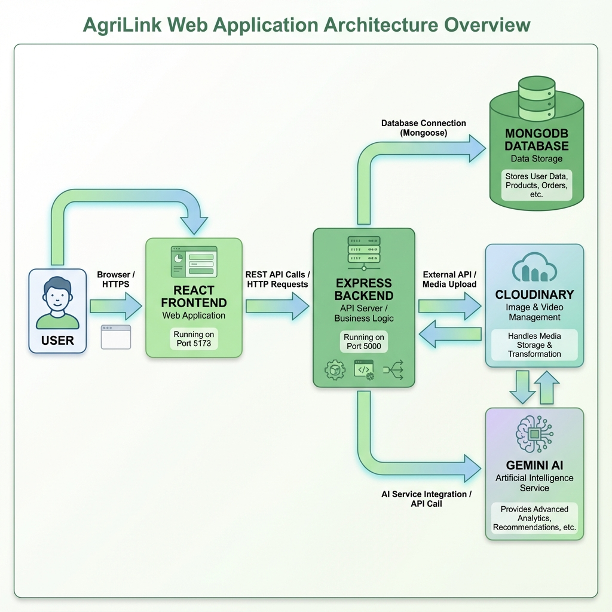

<div align="center">

# 🌾 AgriLink - Full Stack Marketplace

**Connecting Farmers Directly with Customers**

[](client/README.md)
[](server/README.md)
[](https://www.mongodb.com/)

[Features](#-features) • [Quick Start](#-quick-start-guide) • [Architecture](#-architecture) • [Documentation](#-documentation)

</div>

---

## 📖 Overview

**AgriLink** is a comprehensive full-stack web application designed to revolutionize local agriculture commerce. By cutting out intermediaries, it empowers farmers to sell directly to consumers, ensuring fresher produce and better prices.

The platform combines a modern, responsive **search-optimized frontend** with a robust, scalable **RESTful backend**, enhanced by AI-driven features for product management and discovery.

### 📚 Documentation

Detailed documentation for each distinct part of the application can be found here:

| Module        | Description                                  | Documentation                                |
| ------------- | -------------------------------------------- | -------------------------------------------- |
| **🚜 Client** | React-based frontend for Farmers & Customers | [**View Client README**](./client/README.md) |
| **⚙️ Server** | API, Database, and Business Logic            | [**View Server README**](./server/README.md) |

---

## ✨ Key Features

### 🚜 For Farmers

- **Smart Management**: Full inventory control with AI-assisted product descriptions.
- **Business Insights**: Real-time sales analytics and order tracking dashboards.
- **Direct Sales**: Manage incoming orders and chat directly with buyers.

### 🛒 For Customers

- **Farm Discovery**: Interactive maps to find local producers near you.
- **Fresh Shopping**: Seamless e-commerce experience with cart and checkout.
- **Transparency**: View farm profiles, specialties, and sustainable practices.

### 🌐 Platform Power

- **🤖 AI Integration**: Google Gemini integration for content generation.
- **🔐 Secure Auth**: Role-based JWT authentication and security best practices.
- **📱 Responsive**: Optimized for generic desktop and mobile workflows.
- **🌍 Search & Filter**: Advanced spatial and attribute-based search.

---

## 🛠 Tech Stack

### Frontend (Client)

- **Framework**: React 19, Vite 7
- **Styling**: TailwindCSS 3.4, Framer Motion
- **State**: React Context API
- **Maps**: specialized Leaflet integration

### Backend (Server)

- **Runtime**: Node.js (v18+)
- **API**: Express.js 5.1
- **Database**: MongoDB with Mongoose
- **Services**: Cloudinary (Media), Google Gemini (AI), Nodemailer (Email)

---

## 🚀 Quick Start Guide

Follow these steps to get the full stack running locally.

### 1. Clone the Repository

```bash
git clone https://github.com/your-org/agrilink-mvp.git
cd agrilink-mvp
```

### 2. Setup Backend

```bash
cd server
npm install
cp .env.example .env
# Edit .env with your credentials (MongoDB, Cloudinary, Gemini)
npm run dev
```

> Server runs at `http://localhost:5000`

### 3. Setup Frontend

Open a new terminal tab:

```bash
cd client
npm install
cp .env.example .env
# Ensure VITE_APP_API_URL=http://localhost:5000 in .env
npm run dev
```

> Client runs at `http://localhost:5173`

---

## 🏗 Architecture

The project runs as two separate services interacting via REST API.

<div align="center">



**System Architecture Overview**

</div>

The platform follows a modern three-tier architecture:

- **👤 User Layer**: Customers and farmers interact through their web browsers
- **🎨 Frontend**: React-based SPA (Port 5173) providing the user interface
- **⚙️ Backend**: Express.js REST API (Port 5000) handling business logic
- **💾 Database**: MongoDB for persistent data storage
- **🔌 External Services**: Cloudinary (media storage) and Google Gemini AI (content generation)

---

## 🙏 Acknowledgments

Built with [React](https://reactjs.org/), [Node.js](https://nodejs.org/), [Express.js](https://expressjs.com/), [MongoDB](https://www.mongodb.com/), [Cloudinary](https://cloudinary.com/), and [Google Gemini AI](https://ai.google.dev/)

---

<div align="center">

**Built with ❤️ for the agricultural community** 🌾

[⭐ Star this repo](../../stargazers) • [🐛 Report Issues](../../issues) • [💡 Request Features](../../issues)

</div>
